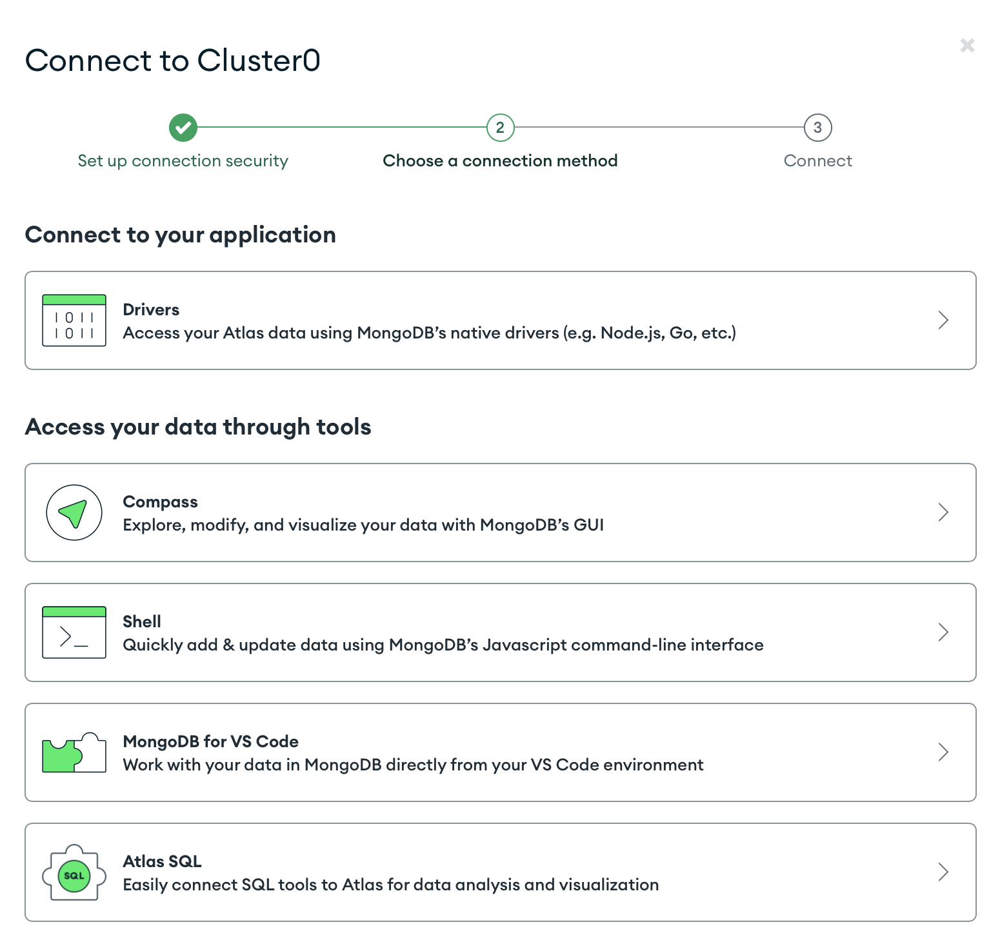

## Setup 
**1) [Atlas](https://www.mongodb.com)**
- *sign in (gmail or github)*
- *configuration*
    - *go to `Database Access` left bar under `SECURITY` section => create users + passwords, and set readWrite privilege*
    - *go to `Network Access` under `SECURITY` => set up accessing IP address*
    - *go to `Database` under `DEPLOYMENT` section*
        - *view clusters information*
        ```
        # NoSQL Database Model 
        ------------------------------------------------------------------------------------------------------
        |                                                                                                    |
        |           Cluster                                                                                  |
        |                                                                                                    |
        |       -----------------------------------------------------------------------------------------    |
        |       |                                                                                       |    |
        |       |               Database                                                                |    |
        |       |                                                                                       |    |
        |       |       -------------------------------------------------------------------------       |    |
        |       |       |                                                                       |       |    |
        |       |       |           Collection                                                  |       |    |
        |       |       |                                                                       |       |    |
        |       |       |       ---------------------------------------------------------       |       |    |
        |       |       |       |                                                       |       |       |    |
        |       |       |       |                                                       |       |       |    |
        |       |       |       |        book           person          rental          |       |       |    |
        |       |       |       |       ---------       ---------       ---------       |       |       |    |
        |       |       |       |       |       |       |       |       |       |       |       |       |    |
        |       |       |       |       |       |       |       |       |       |       |       |       |    |
        |       |       |       |       |       |       |       |       |       |       |       |       |    |
        |       |       |       |       |       |       |       |       |       |       |       |       |    |
        |       |       |       |       |       |       |       |       |       |       |       |       |    |
        |       |       |       |       ---------       ---------       ---------       |       |       |    |
        |       |       |       |                                                       |       |       |    |
        |       |       |       |                                                       |       |       |    |
        |       |       |       |                                                       |       |       |    |
        |       |       |       ---------------------------------------------------------       |       |    |
        |       |       |                                                                       |       |    |
        |       |       |                                                                       |       |    |
        |       |       -------------------------------------------------------------------------       |    |
        |       |                                                                                       |    |
        |       |                                                                                       |    |
        |       -----------------------------------------------------------------------------------------    |
        |                                                                                                    | 
        |                                                                                                    |
        ------------------------------------------------------------------------------------------------------

        # Document (where json files are stored)
        
            Book                person              rental
        -------------       -------------       -------------
        |   .....   |       |   .....   |       |   .....   |
        |   .....   |       |   .....   |       |   .....   |
        |     .     |       |     .     |       |     .     |
        |     .     |       |     .     |       |     .     |
        |     .     |       |     .     |       |     .     |
        |   .....   |       |   .....   |       |   .....   |
        |           |       |           |       |           |
        -------------       -------------       -------------
        ```
        - *connect cluster (`Driver` for python, `Compass` for UI)*
        <br>

        - *click into any clusters (`Cluster0`) => select Collections => delete/drop Databases here*
- *properties*
    - *Multi-Cloud Database Service that connect cloud dataset (like AWS, GoogleCloud) for mongoDB*
    - *Simplifies deploying and managing your databases*

## Connection
&#x23f5; *dependencies*
```shell
# for mongoDB
pip install pymongo 

# for work with dot file in python 
pip install python-dotenv
```
&#x23f5; *[connect.py](./connect.py)*

## Pymongo Arrow

## Schema
